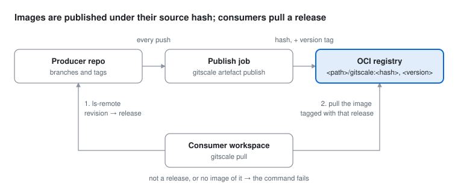

# 2.10 Artefacts

- [How it works](#how-it-works)
- [Choosing how a checkout arrives](#choosing-how-a-checkout-arrives)
- [Which release a checkout gets](#which-release-a-checkout-gets)
- [Publishing](#publishing)
  - [What gets published](#what-gets-published)
  - [Patterns](#patterns)
  - [Groups and layers](#groups-and-layers)
  - [The artefact policy](#the-artefact-policy)
  - [artefact publish](#artefact-publish)
  - [Releasing without rebuilding](#releasing-without-rebuilding)
- [Looking at what is published](#looking-at-what-is-published)
  - [artefact show](#artefact-show)
  - [artefact list](#artefact-list)
- [Where artefacts live](#where-artefacts-live)
- [Logging in](#logging-in)
- [Pipelines](#pipelines)
  - [One-time setup](#one-time-setup)
  - [GitLab](#gitlab)
  - [GitHub](#github)
- [The checkout](#the-checkout)
- [An artefact on a topic](#an-artefact-on-a-topic)
- [No access to the sources](#no-access-to-the-sources)
- [Status](#status)
- [Where images are kept](#where-images-are-kept)

An artefact is a repository's **build output**: the files its own pipeline
produced, published to an OCI registry — GitLab's, GHCR, or any other. A config
says what a workspace depends on; how each checkout arrives is the workspace's
own choice, made per dependency and never written in a config:

- `source`, the default: a git checkout.
- `artefact`: the image of its release **instead of** a git checkout,
  read-only. Nothing of its git history is downloaded.

A frontend developer who never edits the SDKs takes them as artefacts; a
developer without access to a repository's sources gets its artefact with
nothing to configure; whoever develops a repository has its sources, on the
topic.

## How it works



Every image is published under the [source hash](cli.md#git-scale-hash) of
what it was built from: the repository's tree and the trees of every
dependency it resolves. A release adds its version tag to that image. A
workspace takes an artefact only at a release, and finds it by its version
tag — so an artefact is exactly the build of the sources that release names,
and a release with no image is an error, never another image passed off as
it.

## Choosing how a checkout arrives

```
git scale prefer [DIR...]
git scale prefer --source|--artefact <DIR>...
```

```sh
git scale prefer --artefact imports/billing-sdk imports/users-sdk
git scale prefer                     # every preference, with the checkout it applies to
git scale prefer --source imports/users-sdk   # back to the sources
git scale pull                       # the next placement applies them
```

A preference is the repository's — every major of it, wherever it is checked
out — and the workspace's: kept in the root's git common dir
(`gitscale/prefer.toml`), so every worktree of the root shares it, and never in
a config. `prefer` only records; the next placement applies it, and `git scale
ls` shows the change to come meanwhile: `source → artefact`. A checkout holding
work is kept by that placement, as every placement keeps one. CI behaves the
same: a job takes sources unless it runs `git scale prefer` first.

Which form a checkout gets, the first that applies:

1. **On the topic** — joined here, or a branch of the topic followed: its
   sources. See [an artefact on a topic](#an-artefact-on-a-topic).
2. **Its sources cannot be read:** its artefact — see
   [no access](#no-access-to-the-sources).
3. **Its preference.**
4. **Its sources.**

Every request for a repository is one request, whatever form a workspace
takes it in, and it is one checkout per major. A checkout taken as an artefact
lists its repository's refs and nothing more: its dependencies are read from
its image's `gitscale` layer.

## Which release a checkout gets

The revision resolves as for any checkout — see [revisions](dependencies.md#pinning-a-revision) —
and must be a release: a version tag, semver or calendar. The image that tag
names is what is installed — or a [build](dependencies.md#build), pinned by
its source hash to try it out. A branch, a commit or no revision at all fails
the checkout, naming who asks for it; so does a release with no image.
[`artefact show`](#artefact-show) says what the registry holds:

```
FAIL  meta/app: taken as an artefact, but root asks for main, which is not a release
FAIL  meta/app: no artefact for v2.1.0 (ghcr.io/org/app/gitscale)
```

## Publishing

### What gets published

The source repository's own `.gitscale.toml` says which files to ship, as
groups of glob patterns. Each group becomes one layer of the image; nobody
builds or handles an archive by hand.

```toml
[[artefact.layer]]
name    = "vendor"
include = ["dist/vendor/**"]

[[artefact.layer]]
name    = "app"
include = ["dist/**/*.js", "dist/**/*.css", "dist/index.html"]
exclude = ["**/*.map"]
```

With one group, the layer tables can be left out:

```toml
[artefact]
include = ["dist/**"]
exclude = ["**/*.map"]
```

**Every path is the repository's own.** Patterns are relative to the
repository, and a file is stored in the image at the path it has there:
`dist/app.js` unpacks to `dist/app.js`, where a build of that commit would have
put it.

Every key of `[artefact]` is checked when the config is read: an unknown key, a
pattern that leaves the repository, or a group with nothing to include is an
error, not a quietly smaller artefact.

### Patterns

Plain globs with separate `include` and `exclude` lists — the convention of
GitLab's `artifacts:paths` and GitHub's `upload-artifact`. Not gitignore
syntax, whose no-slash, anchoring and `!` rules make it easy to ship more or
less than meant.

| Pattern | Matches |
|---|---|
| `**` | every file in the repository |
| `vendor/**` | everything under `vendor/`, at any depth |
| `vendor` | the same: naming a directory includes its contents |
| `*.html` | `.html` files at the top of the repository only |
| `**/*.js` | `.js` files at any depth |
| `assets/*.png` | `.png` files directly in `assets/`, not in subdirectories |
| `{img,fonts}/**` | everything under `img/` or `fonts/` |
| `report-?.pdf` | `?` is exactly one character |

- `*` stops at `/`; `**` crosses it.
- Patterns are relative to the repository, and may not start with `/` or
  contain `.` or `..` components.
- Files are found by walking the filesystem, not git: build output is usually
  ignored. `.git` is never shipped.

### Groups and layers

- **One layer per group, in the order listed.** The group's name is the
  layer's `org.opencontainers.image.title`.
- **First match wins.** A file matching several groups goes to the earliest,
  so a catch-all last group (`include = ["dist/**"]`) is safe, and no file is in two
  layers.
- **Unmatched files are not shipped.**
- **A group that matches nothing fails the publish**, so a broken build or a
  typo cannot publish an artefact with a hole in it.
- **Layers are reproducible gzip tars**: entries sorted, ownership and times
  fixed, modes reduced to 0644 or 0755, a gzip header with no time or name. The
  same files give the same digests, build after build.
- **Executable bits are kept.** Symlinks are kept when they point inside the
  repository; a selected one that points outside fails the publish.
- **Consumers download only the layers they do not already hold**: when only
  `app` changes, `vendor` is not fetched again.

Split along how often things change: a large dependency layer that changes
once a month, and a small application layer that changes every commit.

**The repository's own `.gitscale.toml` is always shipped**, as a first layer
of its own named `gitscale`, at the top of the artefact. A consumer taking the
artefact learns its [dependencies](recursive-dependencies.md) from it: resolution downloads just that layer, a few hundred bytes, and keeps
it with the images, where every release that left the file alone shares it.
A group never ships it a second time, and may not be named
`gitscale`. The dependencies are linked inside the extracted artefact like any
checkout's.

### The artefact policy

**Every file in an image is either tracked at its commit with the same
content, or ignored by the repository's `.gitignore` rules.** Images hold two
kinds of file: sources shared as they are — generated clients, schemas — and
build output in its usual place (`dist/`, `target/`), which a repository
ignores. So an image holds what its sources are and what a build of them makes,
nothing else.

`artefact publish` enforces it, and fails before anything is pushed — a dry
run too, since what it lists would never ship:

```
Error: 2 files break the artefact policy (each must be tracked and unmodified, or ignored):
  src/client.ts   tracked, modified since 4f2a9c1 — commit it, or leave it out of [artefact]
  dist/app.js     untracked, not ignored — add dist/ to .gitignore
```

The check compares the files with the commit checked out, and applies the
ignore rules git would. The `gitscale`
layer is exempt: it is the config the consumer resolves with, whatever state it
is in. A dry run with no commit to compare with says `policy: not checked` and
goes on.

### artefact publish

```
gitscale artefact publish [-C DIR] [--force] [--dry-run] [--reuse] [RELEASE]
```

Run in the source repository's pipeline, after the build. Given `RELEASE` — a
version, named by the caller — its image is released as it:

1. **Pack the groups** as described above, and check them against the
   [artefact policy](#the-artefact-policy).
2. **Identify the source.** The commit is the one checked out. The repository
   is the job's project (`CI_PROJECT_URL`; `GITHUB_SERVER_URL` +
   `GITHUB_REPOSITORY`), else the `origin` remote with any credentials removed.
   The image name comes from the same mapping consumers use, so the two always
   agree.
3. **Take the [source hash](cli.md#git-scale-hash)** of the sources checked
   out, resolving their dependencies against the remotes as the pipeline does.
   One that cannot be taken, such as a dependency that does not resolve, fails
   the publish; `--dry-run` reports it.
4. **Check the release**, before anything is packed: a `RELEASE` already
   tagging another commit in git, here or on `origin`, fails the publish.
5. **Check the hash tag.** If it already holds the same layers, it says
   `Already published` and stops, after the release below: a retried job is a
   no-op, and a branch build already published is released as it is. If it
   holds different layers, it fails — two builds of the same sources should
   produce the same files — unless `--force` is given.
6. **Push** the layers the registry does not already have, a config blob, then
   the manifest under the hash tag. The manifest carries
   `org.opencontainers.image.revision` (the commit),
   `org.opencontainers.image.source` (the repository URL, which GHCR uses to
   link the package to the repository), `dev.gitscale.tree` (the commit's
   tree) and `dev.gitscale.hash` (the source hash), and no creation time, so
   its digest is reproducible too.
7. **Release it**: the image is tagged `RELEASE`; one already naming another
   image fails the publish, unless `--force` is given. Tagging the commit in
   git is the pipeline's, after this step: then no consumer ever finds a
   release without its image.

```
Publishing ghcr.io/org/app/gitscale:3c9f2a71…
  tags: source hash 3c9f2a7144e0, v1-2026.10.06-153012
  layer gitscale: 1 file, 312 B, sha256:e91d…
  layer vendor: 412 files, 3.1 MiB, sha256:4c1f…
  layer app: 12 files, 84.0 KiB, sha256:a90e…
  gitscale already in the registry
  vendor already in the registry
  pushed app
  pushed config
  tagged v1-2026.10.06-153012
Published ghcr.io/org/app/gitscale@sha256:77d0…
```

`--dry-run` lists every file of every layer and the layer digests, and sends
nothing. It is the way to check patterns: it needs no registry and no commit,
and says which of those it could not work out instead of failing.

```
$ gitscale artefact publish --dry-run
Would publish ghcr.io/org/app/gitscale:3c9f2a71…
  tags: source hash 3c9f2a7144e0
  layer gitscale: 1 file, 312 B, sha256:e91d…
    .gitscale.toml
  layer vendor: 2 files, 1.1 KiB, sha256:4c1f…
    vendor/lib.js
    vendor/lib.css
  layer app: 3 files, 2.0 KiB, sha256:a90e…
    .well-known/security.txt
    app.js
    index.html
```

The image is a standard OCI image — one gzip tar layer per group and an image
config — so `docker`, `skopeo`, `crane` and `oras` read it, and an image another
tool pushed under the right name and tag installs like one gitscale published.

### Releasing without rebuilding

A squash merge gives the default branch a new commit with the same sources as
the branch's last build, which already published under their source hash.
`--reuse RELEASE` packs nothing: that image is released as it is. With no
image of these sources it fails before anything is tagged: `no image of these sources (3c9f…)`; `--dry-run` says what it would
release, and fails the same way.

**Naming and tagging the release are the pipeline's.** GitScale takes the
name it is given; the pipeline makes one, uses it for whatever else it
releases — container images, say — and tags the commit last, once every image
is in place. A calendar version with the time of day as its number needs no
lookup: `v1-2026.10.06-153012`. A rerun keeps the release the commit already
has, asking the remote rather than the checkout, which CI rarely gives tags:

```sh
H=$(git rev-parse HEAD)
V=$(git ls-remote --tags origin 'refs/tags/v1-*' |
    awk -v h="$H" '$1 == h { sub("refs/tags/", "", $2); sub(/\^\{\}$/, "", $2); print $2; exit }')
[ -n "$V" ] || V="v1-$(date -u +%Y.%m.%d-%H%M%S)"
gitscale artefact publish --reuse "$V"
git tag -f "$V" && git push origin "refs/tags/$V"
```

Two release jobs must not run at once — `concurrency` on GitHub,
`resource_group` on GitLab — so two releases are never named in the same
second. If they were, pushing the second tag would fail rather than overwrite
the first.

## Looking at what is published

Two read-only commands, run in the consuming workspace. Neither downloads an
image or records anything.

### artefact show

```
git scale artefact show [DIR...]
```

For each checkout taken as an artefact — or each one named — everything
there is to know right now: the release it is at, the image, whether that
release is published and from which sources, with what layers, what is
installed, and how the two compare. The one place to answer *why does it say no
artefact, missing or changed*.

```
meta/app
  release    v2.1.0
  image      ghcr.io/org/app/gitscale
  published  no
  installed  v2.0.0 (sha256:77d0…)
  status     ref-mismatch, missing
```

A published release names the source hash of its image and lists its layers by
group name, with size and digest. The status compares what is installed with
what the registry has *now* — unlike [`git scale ls`](status.md), which compares
it with what the last fetch saw:

| Status | Meaning |
|---|---|
| `ok` | Installed at the release wanted, with its current image |
| `not installed` | Nothing installed yet |
| `ref-mismatch` | Installed for another release than the one wanted |
| `missing` | The release wanted has no image |
| `changed` | The installed release's image was re-published with different files |

A checkout that cannot be looked up — no registry known, the remote unreachable,
access refused — shows an `error` line with the reason, the others are still
shown, and the command exits non-zero.

### artefact list

```
git scale artefact list [DIR...]
```

Every release a checkout has an image of, newest first, each with the source
hash its image was built from. The installed one is marked:

```
meta/app  ghcr.io/org/app/gitscale  (3 releases)
  v2.1.0  3c9f2a7144e0b2d9…
  v2.0.0  8be104d2c71a5e60…  (installed)
  v1.9.0  1ccd849fb241a932…
```

## Where artefacts live

The image is the repository's path under its registry, lowercased, with a
fixed `gitscale` suffix so artefacts stay apart from the images a project
publishes itself:

| Entry `url` | Image |
|---|---|
| `git@gitlab.com:org/sub/frontend.git` | `registry.gitlab.com/org/sub/frontend/gitscale` |
| `https://github.com/Org/Tools.git` | `ghcr.io/org/tools/gitscale` |
| `https://gitlab.corp.example/team/svc.git` | `registry.corp.example/team/svc/gitscale` (configured) |

The registry is found in this order:

1. `[registries]` in the config: a key containing `/` is a URL prefix
   (the longest that matches wins, and the image path is the rest of the URL);
   anything else is a host.
2. Inside a CI job, the CI server's own host maps to the registry it owns —
   `CI_REGISTRY` on GitLab, `ghcr.io` or `containers.<host>` on GitHub.
3. Built in: `github.com` → `ghcr.io`, `gitlab.com` → `registry.gitlab.com`.
4. Otherwise the entry fails, naming the setting to add.

```toml
[registries]
"gitlab.corp.example" = "registry.corp.example"
"/srv/repos/"         = "registry.corp.example:5000/mirrors"   # URL prefix, with a namespace
```

A registry on `localhost`, `127.0.0.1` or `[::1]` is spoken to over plain
HTTP, every other one over HTTPS — unless its value starts with `http://`, the
opt-in for a registry without TLS on a private network:

```toml
[registries]
"git.lab.internal" = "http://registry.lab.internal:5000"
```

No credential is ever sent over plain HTTP to anything but this machine: such
a registry is used anonymously.

## Logging in

A registry answers an anonymous request with a challenge naming a token
service; gitscale offers that service a credential, in this order:

1. **The CI job token**, in a GitLab or GitHub job — but only to the registry
   that CI server owns (`CI_REGISTRY`; `ghcr.io` or `containers.<host>`), and
   only through a token service on the CI server itself (GitLab's `/jwt/auth`)
   or on the registry (GHCR's `/token`). A registry that points anywhere else
   gets no credentials. As with git, the token is read from its variable when
   a request needs it, and never written anywhere.
2. **What `docker login` stored** for that registry: `~/.docker/config.json`
   (or `$DOCKER_CONFIG/config.json`), including credential helpers such as the
   macOS keychain or `pass`; then Podman's auth file
   (`$REGISTRY_AUTH_FILE`, `$XDG_RUNTIME_DIR/containers/auth.json`,
   `~/.config/containers/auth.json`). `podman login` and `oras login` write
   these too.
3. **Nothing**: a public package needs no credential.

On a developer machine that is one login per registry, with a token that can
read packages:

```
docker login ghcr.io                # a GitHub PAT with read:packages
docker login registry.gitlab.com    # a GitLab PAT or deploy token with read_registry
```

| | GitLab | GitHub |
|---|---|---|
| Credentials in a job | `gitlab-ci-token` + `CI_JOB_TOKEN` | `GITHUB_TOKEN` |
| Publishing | the job token pushes to its own project's registry | `permissions: packages: write` |
| Reading another project's | the consumer on the producer's job-token allowlist — the same one [cloning needs](ci-authentication.md) | the consumer repository added under the package's *Manage Actions access*, plus `permissions: packages: read` |
| Outside CI | PAT or deploy token with `read_registry` | PAT with `read:packages` |

A refusal names whichever of these is missing.

## Pipelines

### One-time setup

1. **Producer**: add an `[artefact]` table and a publish job that runs on every
   push, so the release after a squash merge finds its image. No `rules:
   changes`, `paths:` filters or skip conditions: a release without an image
   breaks every consumer taking it as an artefact.
2. **Producer**: give consumers read access — GitLab's job-token allowlist,
   GitHub's *Manage Actions access*.
3. **GitLab producer**: exempt the version tags of `*/gitscale` from the
   registry's cleanup policy, or pinned releases lose their images.
4. **Consumer**: nothing in its config. A workspace — a developer's, or a job's
   — that wants the artefact runs `git scale prefer --artefact <dir>`.

### GitLab

Producer `.gitlab-ci.yml`:

```yaml
publish:
  stage: build
  script:
    - make dist
    - gitscale artefact publish

release:
  stage: deploy
  rules:
    - if: $CI_COMMIT_BRANCH == $CI_DEFAULT_BRANCH
  resource_group: release
  script:
    - ./release.sh    # see releasing without rebuilding
```

The release job pushes a tag, so its git credentials must be allowed to push
to the project; GitLab's job token is not, by default.

Consumer `.gitlab-ci.yml`:

```yaml
variables:
  GIT_CLEAN_FLAGS: -ffdx -e /meta/

test:
  script:
    - gitscale sync
    - make test
```

### GitHub

Producer workflow:

```yaml
on: push
permissions:
  contents: read
  packages: write
jobs:
  publish:
    runs-on: ubuntu-latest
    steps:
      - uses: actions/checkout@v4
      - run: make dist
      - run: gitscale artefact publish
        env:
          GITHUB_TOKEN: ${{ secrets.GITHUB_TOKEN }}
```

Consumer workflow:

```yaml
permissions:
  contents: read
  packages: read
jobs:
  test:
    runs-on: ubuntu-latest
    steps:
      - uses: actions/checkout@v4
      - run: gitscale sync
        env:
          GITHUB_TOKEN: ${{ secrets.GITHUB_TOKEN }}
      - run: make test
```

Publish on `push`, not `pull_request`: a pull request's checkout is a merge
commit no branch will ever hold. On the default branch, after a squash merge,
the [release needs no build](#releasing-without-rebuilding):

```yaml
  release:
    concurrency: release
    permissions:
      contents: write
      packages: write
    steps:
      - uses: actions/checkout@v4
      - run: ./release.sh    # see releasing without rebuilding
        env:
          GITHUB_TOKEN: ${{ secrets.GITHUB_TOKEN }}
```

## The checkout

A checkout taken as an artefact holds the image and nothing else.

- **[Placement](workflow.md#placement)** resolves the release, downloads
  every layer, checks each against its digest, unpacks them in order, and
  strips the write bits of every file at any depth. Once installed, it does
  nothing — and asks the registry nothing — while the release wanted is the
  one installed. Otherwise it downloads the new image first and only then
  replaces the files, so a registry that fails part way leaves the installed
  version alone. A source checkout there is replaced, unless it holds work.
- **`git scale fetch`** asks the registry what the release's image is now,
  and records it. Nothing is downloaded, and no directory is created. A
  release with no image is an error.
- **[Git commands](cli.md#git-commands-git-scale-git-command)** run across
  the workspace skip them, since there is no repository to run in;
  [`git scale clean`](clean.md) keeps them whole.

The directory holds the artefact's files and nothing else — dot files
included, all of them read-only, all of them replaced on update. GitScale
assumes nothing about their names. What it records about a checkout — the
release and image digest installed, and what the last fetch saw — is
kept outside it, in the root worktree's git directory (`gitscale/artefacts/`).
A checkout deleted by hand is noticed as not installed, whatever was recorded.

An archive may not contain a path that leaves the directory, a symlink
pointing out of it, or anything but files, directories and symlinks.

Files are unpacked with the time of the download, not the archive's, so build
tools never take them for older than their own outputs.

## An artefact on a topic

On a [topic](topics.md), a checkout is its sources whatever its preference:
the topic branch is no release, and a change is tested as its sources. Joined
here, [`git topic join`](topics.md#git-topic-join--leave) takes the image away
and checks the same commit out in its place, writable. A branch of the topic
on its remote is followed as sources too: a workspace taking the repository as
an artefact still sees its branches, as its refs are listed, and a pipeline
tests the change rather than the release before it. Taken off the topic — by
[`git topic leave`](topics.md#git-topic-join--leave) or by
[promotion](topics.md#promotion-git-upgrade) — it takes its preferred form
again, at its release.

## No access to the sources

A repository whose sources this workspace cannot read — the fetch refused, not
the server unreachable — is its artefact, with nothing to configure, when its
registry answers. The registry then stands in for git:

| Needs | From |
|---|---|
| The versions there are | The registry's tags that are [versions](dependencies.md#revision-kinds) |
| Which commit a version names | The image tagged with it: its `org.opencontainers.image.revision` |
| Its own dependencies | The image's `gitscale` layer |
| Its tree, for [`git scale hash`](cli.md#git-scale-hash) | The image's `dev.gitscale.tree` |

So only released versions resolve, as for any artefact: a branch revision fails, `main needs access
to its sources`, and on a topic it stays at its pin, since no branch of it can
be seen. `git upgrade <dir>` raises it to the newest version its registry has.
What the registry said is kept for offline commands, until a fetch of
the sources succeeds again. Neither the sources nor the registry readable: both
errors.

## Status

The `AS` column says how each checkout arrives: `source` or `artefact`, and
`source → artefact` while the next placement is still to apply a preference.
For an artefact, `REF` shows the installed release. The flags:

| Flag | Meaning |
|---|---|
| `ok` | Installed at the release wanted, with the image the last fetch saw |
| `ref-mismatch` | Installed for another release than the one wanted now |
| `missing` | The release wanted had no image when last fetched |
| `changed` | The installed release's image was re-published with different files; the next placement installs it |

`--format json` adds an `artefact` object to the row, with the release and
digest installed and the ones the last fetch saw; every row has `as`,
`as_reason` and `as_next` — see [status](status.md#json-output).

## Where images are kept

On a developer machine, in the root's own [image store](stores.md#images):
every worktree of the root shares it, and a layer shared by several releases is
stored once. In CI, in the per-user [cache](stores.md#the-ci-cache), so the
next job on the runner downloads nothing. The digest a release names still
comes from the registry, and every blob is checked against its digest when it
is read, so a stale or damaged cache changes how many bytes cross the wire,
never which files a checkout gets.

---

[← 2.9 Cleaning](clean.md) · [Contents](README.md) · [Next → 2.11 The agent skill](agents.md)
