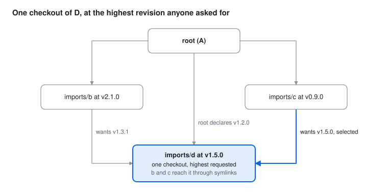

# 2.3 Recursive dependencies

- [The idea](#the-idea)
- [Worked example](#worked-example)
- [How a revision is chosen](#how-a-revision-is-chosen)
  - [Requests and checkouts](#requests-and-checkouts)
  - [Comparing two requests](#comparing-two-requests)
  - [Only selected revisions ask for more](#only-selected-revisions-ask-for-more)
- [Overrides](#overrides)
- [Implicit dependencies](#implicit-dependencies)
  - [Where they go](#where-they-go)
  - [Mode](#mode)
  - [The allowlist](#the-allowlist)
- [Two majors of one repository](#two-majors-of-one-repository)
  - [singleton](#singleton)
- [Errors](#errors)
- [Deduplication by symlink](#deduplication-by-symlink)
- [Turning it off: `recursive = false`](#turning-it-off-recursive--false)
- [Unlinked clones](#unlinked-clones)
- [Orphaned symlinks](#orphaned-symlinks)
- [When resolution runs, and what it fetches](#when-resolution-runs-and-what-it-fetches)

## The idea

A repository in the workspace can carry its own `.gitscale.toml`, declaring its
own dependencies. GitScale reads those configs and resolves them as one graph,
but it never creates a nested copy. Every repository is checked out **once**
per major version, and a dependant that wants it at some path of its own gets a
symlink.

- **Every dependant has a say.** The root, its dependencies and theirs each
  make a *request* for what they need. The highest request wins.
- **Hoisting.** All checkouts live in the workspace, so there is one place that
  says which revision of anything is in play — and `gitscale status --why`
  says how it got there.
- **Version coherence.** Two dependants cannot silently end up with two
  revisions of one major, because there is only one checkout of it.



## Worked example

Root `.gitscale.toml`:

```toml
[repos]
"imports/b" = { url = "git@github.com:org/b.git", revision = "v2.1.0" }
"imports/c" = { url = "git@github.com:org/c.git", revision = "v0.9.0" }
"imports/d" = { url = "git@github.com:org/d.git", revision = "v1.2.0" }
```

`b`'s `.gitscale.toml` at `v2.1.0`:

```toml
[repos]
"libs/d" = { url = "git@github.com:org/d.git", revision = "v1.3.1" }
```

`c`'s at `v0.9.0`:

```toml
[repos]
"vendor/d" = { url = "git@github.com:org/d.git", revision = "v1.5.0" }
```

After `gitscale clone`, `imports/d` is at `v1.5.0`, the highest of the three
requests, and `b` and `c` reach it through links:

```
workspace/
  .gitscale.toml
  imports/
    b/libs/d    → ../../d   (symlink)
    c/vendor/d  → ../../d   (symlink)
    d/                      (the only checkout, at v1.5.0)
```

```
    REPO        PATH   MODE        REF       EXPECTED   STATUS     RESOLUTION
◆   imports/d   -      readwrite   3f2a9c1   v1.5.0     detached   raised from v1.2.0 by imports/c, 3 requests
hint: gitscale status --why <dir> lists every request behind a revision
```

Each link is created relative to its own directory, so the workspace can be
moved or copied without breaking them.

## How a revision is chosen

### Requests and checkouts

Every entry in every config read is a request: who asked, the path it came by
(`root → imports/b@v2.1.0`), and the revision. The root's own entries are
requests like any other — so the root can raise a dependency, but not lower it
without an [override](#overrides).

Requests land in checkouts — *slots* — keyed by three things:

- **The repository**, by URL, normalised so that SSH and HTTPS spellings of one
  repository are the same.
- **Its major**: the semver major, or for `0.x` the minor, as Cargo has it. A
  calendar version is in one class of its own. A branch or a commit has no
  major: it joins the checkout its repository's versions are in, and is an
  error when those are two majors.
- **Source or artefact.** A built artefact and the source tree are different
  files, and never share a checkout.

An entry with no revision asks for nothing, and follows whatever the others
ask for. In the root's config it still chooses where the checkout goes and its
mode; in a dependency's it only names the link inside that dependency. When nobody asks for
anything, the checkout follows the branch it is on, as an entry without a
revision always has.

### Comparing two requests

| Request 1 | Request 2 | Result |
|---|---|---|
| semver | semver, same major | The higher version, spelt as its own tag (`1.2.4` stays `1.2.4`) |
| calendar version | calendar version, same stream | The higher version |
| same revision, or the same commit | | Equal |
| anything else | | **Position**: the request from the repository above the other wins |

*Position* is what decides when two requests are not versions of one stream —
a branch against a tag, a commit, tags of two streams. Repository P is *above*
Q — dominates it — when every path from the root to Q passes through P: Q is in
the workspace only because P needs it. The root is above everything, so a root
entry at `main` wins over any dependency's version. Two requests neither of
which is above the other cannot be ordered, and resolution fails:

```
Error: cannot order main against v2026.09.30: they are not versions of one
stream, and neither repository is above the other. Ask for versions in both,
or set the revision in a repository above both, such as the root
```

No git history is read, so a shallow CI checkout resolves exactly as a
developer machine does. On a developer machine, where the cache mirrors hold
the history anyway, a winner that turns out to be behind what a losing request
asked for is flagged in `status` — `behind imports/c's v2026.09.30` — without
changing the result.

What counts as a semver or a calendar version, and what a stream is, is in
[revision kinds](dependencies.md#revision-kinds).

### Only selected revisions ask for more

Raising B to a new revision changes the `.gitscale.toml` that decides D, so
resolution repeats until nothing moves. Only the revisions that are selected
make requests: the configs of the checkouts the workspace ends up with are
exactly what decided the result, and a revision that loses neither raises
anything nor brings in a checkout.

Configs are read from git objects at the selected commit, not from working
trees — except a checkout already at that commit, whose own file is read, so
an edit not yet committed takes effect at once.

## Overrides

A request is a minimum. To hold a dependency **down** — to step around a
regression in v1.5.0, say — a repository marks its entry `override = true`:

```toml
"imports/d" = { url = "git@github.com:org/d.git", revision = "v1.4.0", override = true }
```

- It asks for exactly that revision, and needs one.
- It wins over every request from a repository it is above, and replaces them.
- It must agree with every other request: each must be at or below it.
  Otherwise resolution fails, naming both.
- Of two overrides, the one from the repository above the other wins; neither
  above the other, they must name the same commit — and then each wins over
  what its own repository is above.
- Any repository above both sides of a conflict settles it with an override of
  its own — ultimately the root, which is above everything.
- It also covers a dependency pinned to a revision its repository does not
  have — a deleted branch, a tag that was removed — in a config you cannot
  edit. Overruled by an override from above, that pin is only a note:
  `held at v1.2.0, imports/b wants develop (no such revision)`. Without one it is an
  error.

`status` shows the icon `↧`, `override` in STATUS, and
`held at v1.4.0, imports/c wants v1.6.0` in RESOLUTION on a row an override
holds below a request it beat.

## Implicit dependencies

A dependency the root does not declare is checked out anyway, as an *implicit*
checkout: cloned, linked and reported like a declared one, but never written
into the root config.

```toml
[resolve]
hoist_dir = "imports"                  # default
allow = ["github.com/partner-org/*"]   # see below
```

### Where they go

- `<hoist_dir>/<name>`, where `<name>` is the last part of the directory the
  dependant declared: `vendor/shared` lands at `imports/shared`.
- When dependants name it differently, the repository's own name from its URL.
- A second major gets a suffix — see [two majors](#two-majors-of-one-repository).
- An artefact checkout of a repository that also has a source checkout gets
  `_artefact`.
- Two repositories wanting one path is an error; declare one at the root under
  another directory.

Keep `hoist_dir` in the root's `.gitignore`, as with every checkout directory.

### Mode

Implicit checkouts are `readonly`, or `artefact` when that is what was asked
for: nobody chose to develop in them. To work on one, declare it at the root
with no revision and the mode you want — the root then chooses its path and
mode, while the revision still comes from resolution:

```toml
"imports/d" = { url = "git@github.com:org/d.git", mode = "readwrite" }
```

### The allowlist

The root listing every URL used to double as a review of what the workspace
pulls in. Implicit checkouts let a dependency bring in a repository the root
never named, so they come only from repositories an allowlist covers:

- every repository the root declares allows its host and top-level owner —
  `git@github.com:org/core.git` allows `github.com/org/*`, nested groups
  included;
- the root repository's own `origin` does the same;
- `[resolve] allow` adds patterns, in the syntax
  [`hook install --allow`](hooks.md) takes.

Only the root's config feeds it, so trust does not grow down the graph. Local
paths are never allowed by the first two rules. Anything else fails, with the
line to add:

```
Error: root → imports/b@v2.1.0 → libs/x wants git@github.com:stranger/x.git, which is
not on the allowlist for implicit dependencies; add "github.com/stranger/*" to
[resolve] allow in the root .gitscale.toml, or declare it at the root
```

## Two majors of one repository

Different majors get a checkout each, placed automatically: no dependant ever
sees the hoisted path, only its own link.

| Dependants want | Root declares | Checkouts |
|---|---|---|
| `mylib` v1.x and v2.x | nothing | `imports/mylib` for v1, `imports/mylib_v2` for v2 |
| v1.x and v2.x | `imports/mylib` at v1.2.0 | the root's for v1; `imports/mylib_v2` for v2 |
| v1.x and v2.x | `imports/mylib` and `imports/mylib_v2`, with revisions | the root's, by major |
| v0.3.x and v0.4.x | nothing | `imports/mylib` for 0.3, `imports/mylib_v0.4` for 0.4 |

The lowest major keeps the plain name, so a new major *above* those already
there never renames anything; a new major below them takes the plain name, and
the others move to suffixed names on the next `sync`. A plain name the root
already uses for another major of the repository is never taken: the implicit
one gets its suffix instead (`imports/mylib_v1` beside the root's v2 at
`imports/mylib`). Each such row says `2 majors` in `status`. Two root
entries for one repository need revisions to tell their majors apart.

### singleton

Some repositories must never be checked out twice — protocol definitions, a
schema, a library with global state. Mark the entry, wherever the repository is
declared:

```toml
"imports/proto" = { url = "git@github.com:org/proto.git", revision = "v2.1.0", singleton = true }
```

or let the repository say so of itself, with a top-level `singleton = true` in
its own `.gitscale.toml`. Every request for it must then be one major, or
resolution fails; an override settles it. An explicit `singleton = false`
relaxes a `true` from the repositories its own repository is above — on the
root's entry, any.

## Errors

Every error is raised by resolution, before anything is cloned, moved or
linked. `status` prints it above the table and marks the rows `unresolved`.

| Error | When |
|---|---|
| `cycle` | A chain of dependencies comes back to a repository already on it, the root included. Checked across every revision resolution considers, not only the ones selected, which is what guarantees resolution ends |
| `cannot order` | Two requests that are not versions of one stream, neither from a repository above the other |
| `override conflict` | An override below a request it is not above |
| `conflicting overrides` | Two overrides neither above the other, at different commits |
| `two repositories want` | Two implicit checkouts on one path |
| `not on the allowlist` | An implicit dependency from somewhere the allowlist does not cover |
| `is a singleton` | Different majors of a singleton |
| `is not a branch, tag or commit` | A branch or tag the repository does not have, and no override from a repository above the one that asked for it. A full SHA is not checked by name: one the repository does not have fails when its config is read, as `cannot fetch .gitscale.toml at <sha>` |

## Deduplication by symlink

A symlink is created when the target checkout exists; entries whose target is
not there yet are skipped and picked up on a later run. GitScale never clobbers
a real file or directory sitting at a link path — that is reported by
[`status`](status.md) as `unlinked` and fixed by [`sync`](workflow.md#sync).

- Symlinked entries are skipped by `fetch`, `push`, `commit` and
  [`clean`](clean.md). Run inside a child repository, `clone`, `pull` and
  `sync` leave them in place too, since the outer workspace decides which
  revision that checkout is at. Naming the entry (`gitscale clone imports/shared`)
  is how one is unlinked into a checkout of its own.
- `status` shows them as `⤷ symlink`, with the link target in the `PATH` column.
- An artefact's dependencies come from the `.gitscale.toml` its image carries,
  and are linked inside the extracted artefact — see
  [artefacts](artefacts.md#what-gets-published).
- Symlink dedup is a Unix mechanism; GitScale runs on Linux and macOS. Windows
  is [planned](plans/windows-support.md).

## Turning it off: `recursive = false`

```toml
"vendor/tools" = { url = "https://github.com/org/tools.git", revision = "main", recursive = false }
```

GitScale then does not read that repository's `.gitscale.toml` at all. It makes
no requests for it, creates no symlinks inside it, and
[`clean`](clean.md#per-repo-clean) cleans it without the keep-list that config
would have supplied. An implicit checkout is read unless every request for it
says `recursive = false`.

## Unlinked clones

If a path that should be a symlink holds a real clone instead — someone cloned
into it by hand, or it predates the dependency being hoisted — `status` flags
the **parent repo** as `unlinked`, and `sync` fixes it:

- A clean clone is removed and the symlink restored automatically.
- A clone with uncommitted changes or unpushed commits is left alone and
  reported, and `sync --force` is required to replace it. The check descends
  into that clone's own nested dependencies, so work in a grandchild counts too.

## Orphaned symlinks

When a dependency is removed from a child config, the symlink it had is left
behind. GitScale recognises its own links — relative, and pointing at a
checkout of the workspace, anything under the hoist directory, or a direct
child of the workspace root — and reports them as `orphan`:

- **Broken orphans** (the target is gone) are removed automatically by `sync`.
- **Orphans whose target still resolves** are only removed with `sync --force`,
  since something may still be using them.

An implicit checkout nothing asks for any more — like a declared one whose
entry was removed — is removed by `sync` when it holds nothing to lose (no
uncommitted changes, unpushed commits or stash; files git ignores go with it), and
kept otherwise, with `sync` failing until it is dealt with or `--force` is
given. See [sync](workflow.md#sync).

Symlinks you created yourself, and anything absolute or pointing elsewhere, are
never touched.

## When resolution runs, and what it fetches

| Command | Resolves | Implicit checkouts |
|---|---|---|
| `clone` | Against the remotes, before cloning anything | cloned |
| `pull` | Against the remotes, before moving anything | new ones cloned |
| `sync` | As `clone` and `pull`, then relinks and removes orphans | removed when left behind and clean |
| `fetch` | Against the remotes, refreshing what `status` reads | fetched |
| `status` | Offline from what is on disk; `--fetch` refreshes first | shown as rows |
| `clean` | Offline, for the keep-list | kept |
| `resolve` | Against the remotes | never written |

Resolution reads, per repository, its branches and tags and the
`.gitscale.toml` of each selected commit — never history:

- **Developer machine, cache on**: from the [cache](caching.md) mirror, the
  entry the checkout is built from anyway, updated once per command.
- **CI, or `--no-cache`**: refs from `git ls-remote`, kept in a small store in
  the workspace's git directory, and each config from that one commit fetched
  at depth 1 without files beyond it — in CI with the cache on, from the
  snapshot the checkout is built from.
- **Artefacts**: refs the same way, and the config from the image's `gitscale`
  layer, kept in the cache.

Offline, a repository nothing has fetched yet is `unresolved`, with a hint to
run `status --fetch`.

---

[← 2.2 Status](status.md) · [Contents](README.md) · [Next → 2.4 Everyday workflow](workflow.md)
